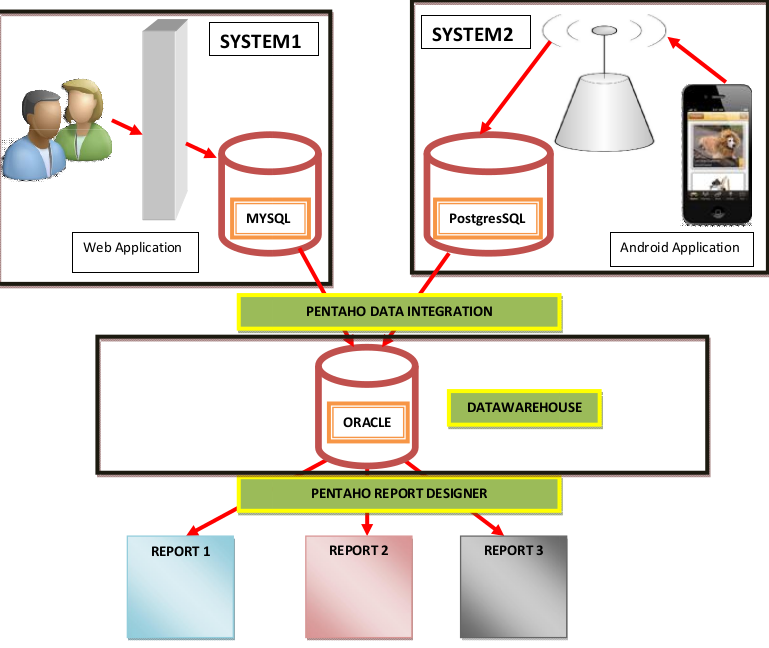

# WHsePentaho

## DESCRIPTION DU PROJET

  L’université est une organisation estudiantine dont la mission est de promouvoir le savoir et le savoir faire. Pour parvenir à
atteindre ses objectifs elle dispose d’un ensemble de services comme :
* Le service de gestions des inscriptions(SYSTEM1)
* Le service de gestions des étudiants avec leurs notes(SYSTEM2)

   Dans le but de bien appréhender la notion de **DATA WAREHOUSE** et de **Buisness intelligence(BI)**, nous allons considérer ces 2 services.

## ARCHITECTURE GENERALE DU PROJET

